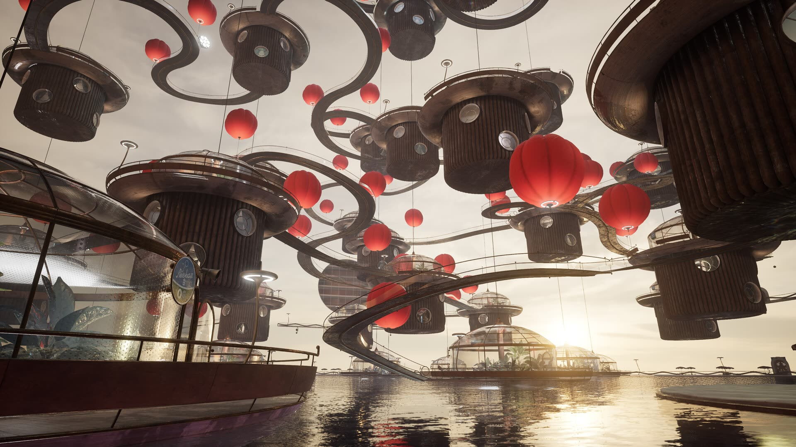
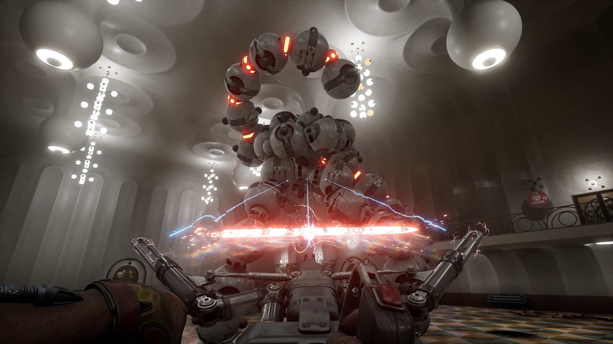

Начинал её ещё на релизе в 2023-м — тогда она была только в VK Play. И дальше первой лаборатории не прошёл =\

И тут она наконец-то вышла в Steam со всеми DLC. Решил — пора! =)

Вайб СССР будущего — наверное, самое цепляющее, что есть у игры. Занятный сюжет, смешные записочки и голосовые сообщения. Лор прям живой. Чувствуется, что её делали с душой. Геймплей достаточно простой, но я бы не сказал, что он мне сильно надоел за прохождение: всю игру весело фигачить огромной трубой роботов и прочую нечисть, порождённую советскими умами. Ну и Элеанора.. =)

Но сюжетка прям НЕ законченная. Так что DLC — обязательные.

## Моменты

### Почти дропнул

Начал проходить первое DLC: поиграл час, а на следующий день уже думал дропнуть игру и досмотреть её на ютубе у Куплинова. Посмотрел ровно одну серию — ту, где он дошёл до того же момента, что и я. И понял, что ХОЧУ сам :D

### Правая рука, левая рука

Босс первого DLC — лютая душнота. Оказался сложнее всех боссов основной сюжетки вместе взятых: раз десять его пытался завалить. До этого я почти не умирал)) Очень удивил скачок сложности.

### Гусь-матершинник

Гусь-матершинник — ван лав. Включайте звук =) Если захочется погрузиться, нашёл [видос на ютубе, где все реплики собраны](https://youtu.be/jsdJyVLty4E) — считаю практически искусством :D

### Trapped in Limbo

Мягко говоря, был удивлён этим дополнением :D Но оно однозначно классное) Даже не знаю, как это назвать.. Что-то в духе Марио с забавными механиками в кумарном мире..)

Очень атмосферно и разительно отличается от основной сюжетки. Как перерыв зашло отлично. Не знаю, что они там курят, но это определённо шикарный опыт =)

