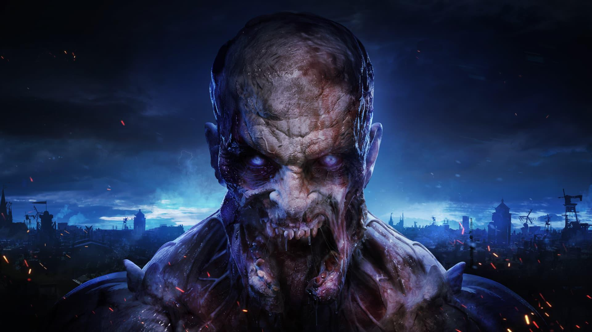
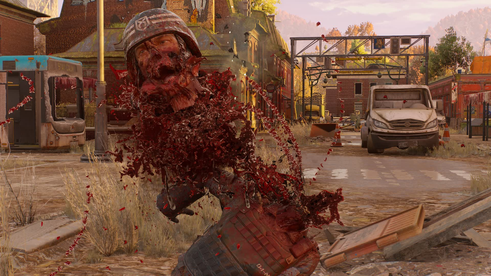

Взял её в конце прошлого года и почти дошёл до финала. Почти =\

Геймплей тут очень приятный, но главная сила игры — паркур. Перемещаться по городу — безумное удовольствие. Не «добежать из точки А в точку Б», а прям кайфануть от самого движения.

Сюжет простенький, но неплохой. Хотя игра, кмк, вообще не про сюжет.

Чего не хватило — ощущения прогресса. Я прокачался так, что стало откровенно просто, а дальше игре было особо нечем меня баловать. Вот интерес и поугас.

Пройти прям стоило. Но что-то отвлёкся..

## Моменты

### Ночью лучше не выходить

Блин. Она на удивление страшная! :D

По городу ходят прыгуны. И я помню, как сидел в кустах. Минут десять. Не двигался, поглядывал, как они шарятся вокруг и — к счастью — меня не видят. Просто ждал утра.

### Разлетается красиво {spoiler}

Отдельно отмечу физику ударов по телам нечисти. Разрабы прям заморочились с проработкой — ближний бой тут крайне приятный.
