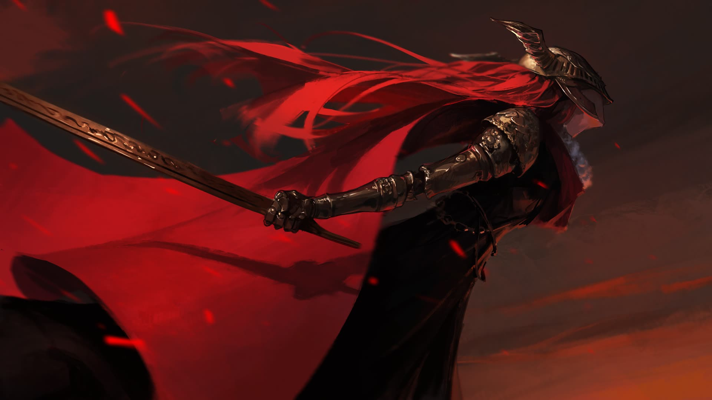

Очень ждал эту игру.

Начал один. Потом мы поставили кооп-мод — и оказалось, что вдвоём в соулс-лайк играется совершенно иначе. Львиную долю челленджа это, конечно, срезало: боссы стали заметно проще. Зато мы её прошли.

Из каноничных Dark Souls я осилил только третью — сам до сих пор удивляюсь, что осилил. Поэтому сказать, легче Elden Ring или тяжелее, у меня не выйдет: вдвоём это просто другой опыт.

Но впечатление всё равно осталось огромное. Мир открытый, интересный, и никакой коридорной клаустрофобии, как в DS3. Красивейшие локации и боссы.

Забавно, что фанатов у неё столько же, сколько хейтеров. Я в фанатах. Казуальной я её не считаю — её осовременили, сделали чуть проще, чтобы играли не только самые хардкорные. Простой она от этого не стала.

DLC мне подарили. Пока не открывал: чтобы снова в это нырнуть, нужен другой я.

## Моменты
### Маления

Хоть убей не помню, добил ли я её. Прям стёрлось. Заходов было точно десять-двадцать, а потом я, похоже, просто забил.

Steam помнит лучше меня: ачивки за Малению нет. Зато есть Лоретта — босс на подходе к ней, и ачивка за Лоретту выбита в тот же день, что и финальная. Значит дошёл до порога, побился и свернул.

P.S. Да, я был тот слабак, который в итоге проходил с катаной :D
