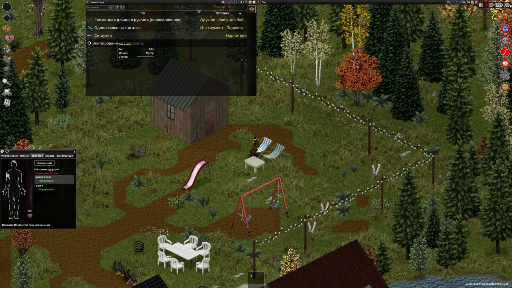
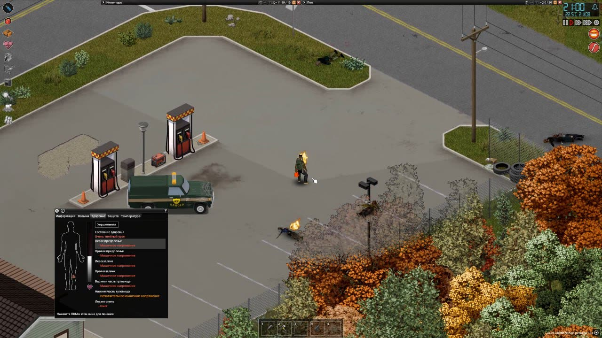
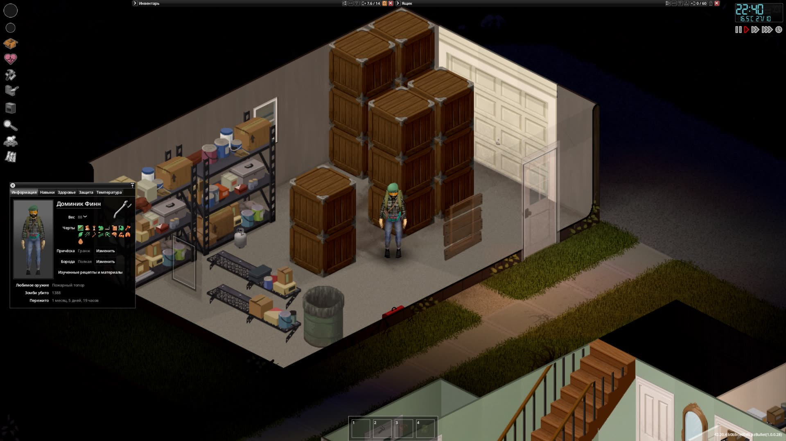

В первый раз я зашёл в неё лет десять назад — и почти сразу вышел. Не разобрался, как в это вообще играть =\

В этот раз прям настроился разобраться. И не пожалел.

Главное, что меня зацепило: задаёшь себе вопрос «а как бы я сделал это в реальной жизни?» — и в игре оно с высокой вероятностью делается ровно так же. Оставил ключ в зажигании — следующий персонаж находит машину с пустым баком. Снял аккумулятор с грузовика — к легковушке не подходит. Промок под дождём — кашляешь, а на кашель приходят зомби. В городе отключили свет — бензоколонки не работают. В общем, супердетализированное выживание, где всё продумано до мелочей.

Вкатываться при этом сложно. Интерфейс непривычный — хотя часов через 80–100 он начинает нравиться :D А топ всех моих смертей — изометрия: по привычке ведёшь мышку к голове, а из-за проекции целиться надо в ноги. Пока разбираешься с геометрией, зомби разбираются с тобой.

Умирал я много. Смерть персонажа здесь не конец игры: создаёшь нового человека в том же мире, идёшь к старой базе, находишь себя-зомби, убиваешь ещё раз и забираешь вещи. Из этих будней выросли [Хроники Project Zomboid](https://pub.artfaal.ru/project-zomboid-stories/) — двадцать девять глав и шесть персонажей.

Почти все часы в шапке — за две недели, по восемь-девять в день. В какой-то момент моя жизнь натурально превратилась в Project Zomboid, и стало понятно, что пора остановиться.

Последний персонаж, лесоруб Доминик Финн, остался жив. Впервые история закончилась не смертью персонажа — просто игрок наконец вышел из игры =) Сингл на этом закрыт, кооп с друзьями продолжается.

## Моменты

### Последняя сигарета. Дубль три

Все мои персонажи — курильщики. Первый умер у гриля, не успев прикурить. Второй докурил, допил ром и облил себя бензином. Третий, пожарный, доехал до дома у воды, сел в шезлонг и стал ждать. Ритуал сложился сам собой: разложить весь лут по ящикам, взять одну сигарету и уйти красиво =)

### Я в бензине, чёрт побери

Оживил бензоколонки генератором, залил полный бак и восемь канистр. И решил сжечь трупы вокруг заправки, чтобы не мешались, — на лёгкой сложности так уже делал. Поджигаю первого зомби и загораюсь сам. Выжил с одним-двумя процентами здоровья, потом неделю лечился коньяком, снотворным и макаронами с сальсой :D

### Три зомби, говоришь?

А у меня тут чуть инсульт не случился :D

### 1388

Лесоруб прожил месяц с небольшим и убил 1388 зомби. Любимое оружие — пожарный топор, разумеется. На пожарном каждая толпа была отдельным событием, на лесорубе стала просто работой. Склад забит башнями ящиков, военная база зачищена, газосварка наконец выучена — и новизна отпустила.
